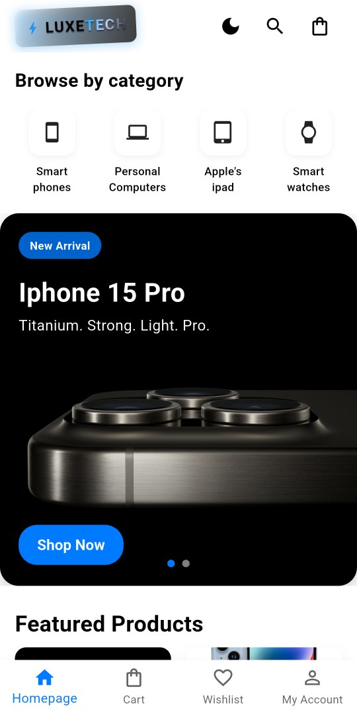
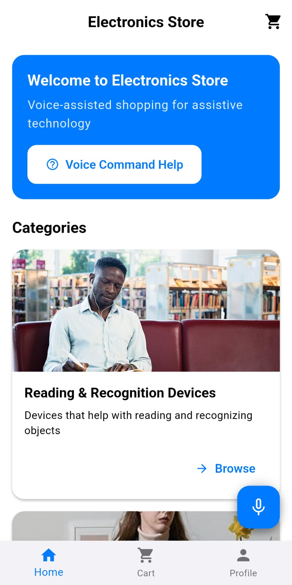
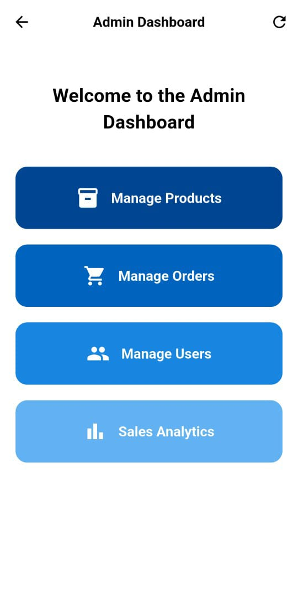

# LuxTech – An Inclusive , Accessibility-Focused Electronics Store Flutter App
**LuxTech** is a dual-interface mobile application developed as part of our graduation project. It’s designed to make online electronics shopping more inclusive and efficient by focusing on accessibility and usability.

## The app aims to serve two groups
1. **Primary Users:** People with partial or complete visual impairment 
- Built-in voice assistant that allows full navigation and interaction through intuitive, easy-to-remember voice commands.
- Designed for full control without relying on visual input. 

2. **Secondary Users:** 
- Normally-sighted people
- 3 color-blind-friendly themes that change the entire app's color scheme to suit different types of color vision deficiency.

 
 
 Secondary Users homescreen - Primary Users homescreen - Admin Dashboard screen 

 

  &nbsp;&nbsp;
  &nbsp;&nbsp;
  

 

## ✨ App Feature Highlights
🔐 Log In & sign Up | Email confirmation |  profile management (Data is synced with supabase in real time)
 

🛍️ Browse products by categories and search | 🛒 Add to cart , place/return 
orders | ⭐ Order Ratings | 🎨 Theme switcher (color blindness themes)  

🗣️ Voice assistant for full voice control

## Admin Dashboard Features
📦 Add, edit, and delete products

👥 Manage user access (block/unblock users)

📊 View and track orders

💳 View refund details (after approving returns)

🔁 Handle returns and customer issues

## 🛠️ Tech Stack
**Frontend:** Flutter (Dart)

**Backend:** Supabase (PostgreSQL, Auth, Storage, Function , Triggers,..)

**Database:** PostgreSQL with Row-Level Security (RLS)

**State Management:**
Provider is the main state management solution. The app uses ``ChangeNotifierProvider``, ``MultiProvider``, and classes like ``ProductProvider`` , ``CartProvider``, ``AuthProvider``, ``OrderProvider``, and ``WishlistProvider``  All of which extend ChangeNotifier for ``reactive updates``.

**Local Storage Management:** ``shared_preferences`` is used to persist local data, including:
- Auth tokens, user info, and blocked user data (``AuthProvider``)
- Cached product data and quantities (``ProductProvider``)
- Cart items (``CartProvider``)
- Wishlist items (``WishlistProvider``)

**Each provider has dedicated methods to load/save this data using ``shared_preferences``
, Examples:**

- ``ProductProvider``: ``_saveToSharedPreferences``, ``_loadFromSharedPreferences``

- ``CartProvider``: ``_saveCartItems``, ``_loadCartItems``

- ``WishlistProvider``: ``_saveWishlistToPrefs``, ``_loadWishlistFromPrefs``

- ``AuthProvider``: ``_saveAuthData``, ``tryAutoLogin``, etc.

**Authentication:** Supabase Auth with role-based access (Admin , User)

**Realtime Sync:** Supabase Realtime Subscriptions – to sync products,and user data without reloading manually.

**Offline Caching:** Local database caches product data on the device to reduce redundant Supabase fetches. Data updates automatically via Supabase Realtime subscriptions whenever a change is detected.

**Media Hosting:** Supabase Storage – for storing and retrieving product images.

📦 <strong>Additional Libraries & Packages Used (Click to show)</strong>

### 🖌️ UI/UX & Utility  
- `flutter_svg` – Render SVG images  
- `cached_network_image` – Image caching with placeholders  
- `shimmer` – Skeleton loaders  
- `carousel_slider`, `dots_indicator` – For image sliders  
- `lottie` – Animated assets  
- `fl_chart` – Graphs and charts  
- `google_fonts`, `intl` – Fonts and localization  

### 🧭 Navigation  
- `go_router` – Declarative routing and deep linking  

### 📱 Device & Platform Integration  
- `connectivity_plus` – Network status  
- `local_auth` – Fingerprint/face authentication  
- `package_info_plus`, `device_info_plus` – Device/app info  
- `path_provider` – Accessing file system  

### 🌐 HTTP Requests  
- `http` – Used for Supabase functions and other HTTP calls  

## 🗃️ Backend & Database
- ``supabase_flutter`` – Supabase integration (auth, database, storage)

## 📦 Core & State Management
``provider`` – Main state management solution 

### 🚀 Splash & Icons  
- `flutter_launcher_icons` – App icon generation  
- `flutter_native_splash` – Custom splash screen  

## 🔑 Permissions & Device
- ``permission_handler`` – Runtime permissions

### 🗣️ Voice & Accessibility
- ``speech_to_text`` – Speech recognition
- ``flutter_tts`` – Text-to-speech

## Full App Screenshots:
Explore the full interface for each user type by clicking the links below:
- [🧑‍🦱 Secondary Users Interface](docs/secondary.md)

- [🛡️ Admin Dashboard Interface](docs/admin.md) 

- [🦯 Primary Users Interface](docs/primary.md)

## Full App Video & Project Documentation: [Here](https://drive.google.com/drive/u/2/folders/1QiA14KGVweFBvd0p_YZLZpH2SbCasOKq)

## 📲 Try the App Yourself
Want to explore **LuxTech** on your own device? , Download and test the latest versions below:
- 🧑‍🦱 [**Secondary Users Version(includes admin dashboard)**](https://github.com/DavidG2Q/LuxTech-ElectronicsStore/releases/tag/secondary-v1.0.0)
- 🦯 [**Primary (Voice-controlled, for visually impaired users)**](https://github.com/DavidG2Q/LuxTech-ElectronicsStore/releases/tag/primary-v1.0.0)
> ✅ Simply Install the APK directly on your Android device to experience the full functionality.
  You can also check all builds in the [Releases Section](https://github.com/DavidG2Q/LuxTech-ElectronicsStore/releases)

## 🙏 Special Thanks
Our Academic Doctors and Supervisors:
Thank you for your valuable guidance, insights, and constant encouragement which helped bring this project to life. 
Your support and collaboration were essential to the success of this work. 
A special thanks to my team members for their contributions during the development process, and to everyone who supported us in any capacity.

## 👥 Team
[David Gamil](https://github.com/DavidG2Q) (Lead Developer)   |   [Yassa Mouris](https://github.com/yassaYM7)   |   [Mostafa Hassan](https://github.com/Mostafaa212)   |   [Khaled Ashraf](https://github.com/Recker-13)

## 📄 License
This project is licensed under the **Creative Commons Attribution-NonCommercial 4.0 International (CC BY-NC 4.0)** license.   

You may use, copy, and adapt this project **only for non-commercial purposes** and must give appropriate credit.

🔗 [View License Details](https://creativecommons.org/licenses/by-nc/4.0/)
